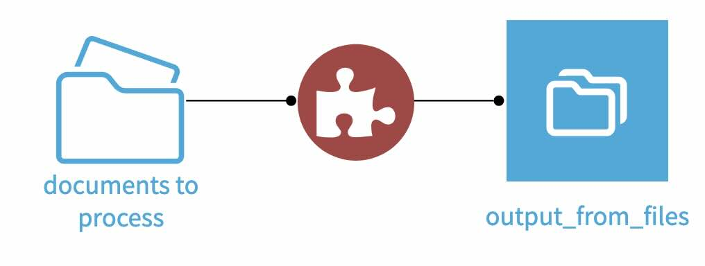
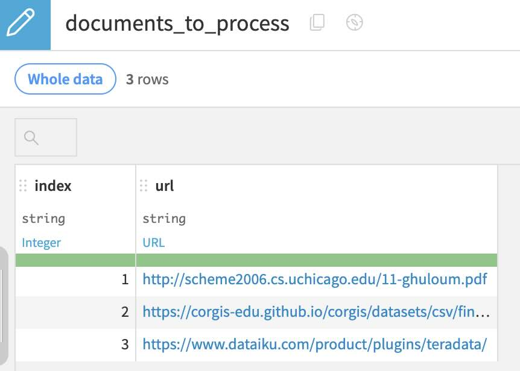
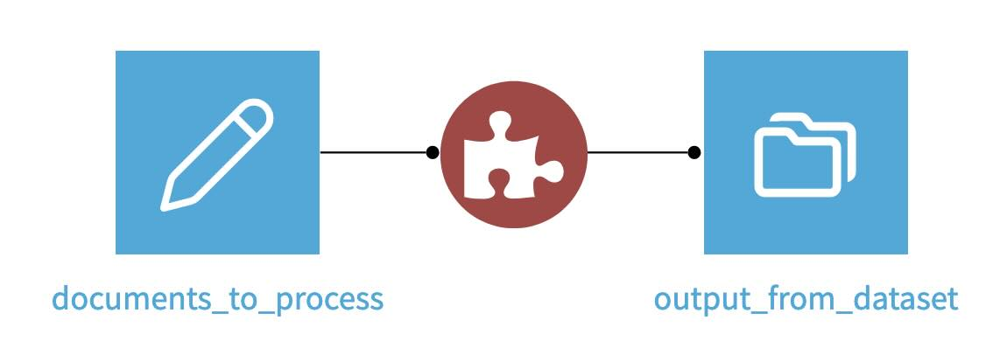

# Dataiku MarkItDown plugin

Based on Microsoft's [MarkItDown](https://github.com/microsoft/markitdown) library, converts various documents types to [MarkDown format](https://en.wikipedia.org/wiki/Markdown). 

The plugin consists in a custom recipe that takes a list of document to process as input. This dataset is duplicated at the output of the recipe, with an extra column containing the document in markdown format.

The library currently process HTML, PDF, CSV, JSON, XML, various MS formats.

## How to use

### With the source documents in a folder

⚠ This method will create a temporary cache on your DSS instance home folder.

- Have a managed folder containing all the documents to processed in your flow
- Click on the source folder, then > Plugin recipes > Markitdown > Ingest, create the output folder
- Run the custom recipe

The output dataset will contain `path` and a `markdow_document` column.

### With the source documents listed in a dataset

- Have a dataset containig the list of document to process in a column, here "`url`"

- In the flow, add the MarkItDown recipe by clicking on `+Recipe > Plugin > MarkItDown > Ingest`
- Use the documents list's dataset as an input, and create an output dataset.

- In the recipe, select the column containing the documents URL
- Run the recipe

The output dataset should contain the input dataset, as well as an extra `markdown_document` column.
